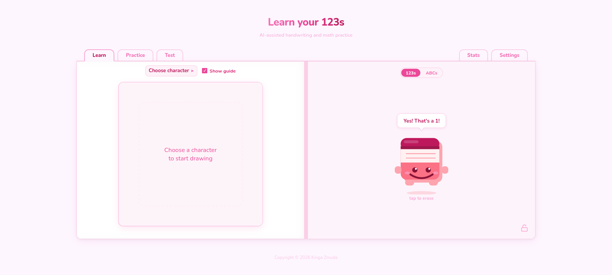
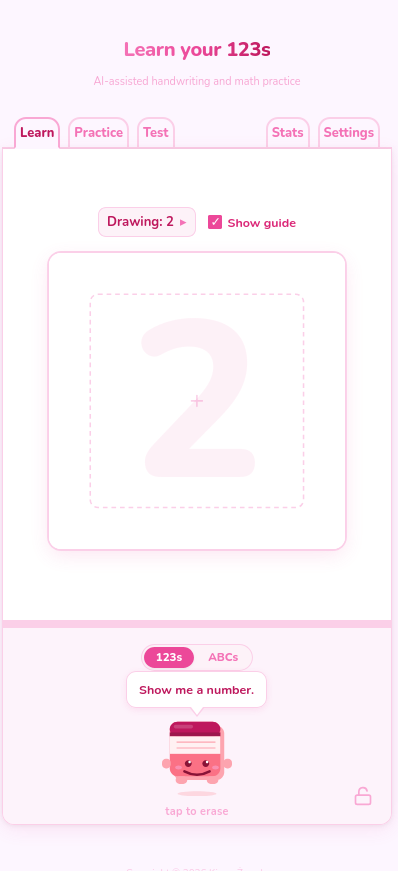
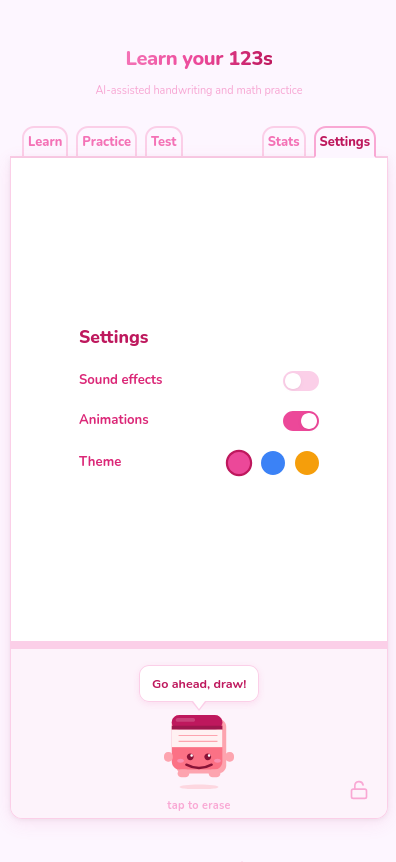

# Learn Your 123s

An AI-powered handwriting practice app for children — draw digits on a canvas and get instant feedback from a trained recognition model, guided by an animated mascot. Excellent on tablets, computers and mobile phones!

**Live demo:** [learn-your-123s.vercel.app](https://learn-your-123s.vercel.app)
- frontend on [Vercel](https://learn-your-123s.vercel.app)
- backend on [Hugging Face Spaces](https://huggingface.co/spaces/kingazm/learn-your-123s)
- model weights at [Hugging Face Models](https://huggingface.co/kingazm/handwriting-recognition).

## Preview
<div style="display:flex; gap:12px; align-items:flex-start;">
  
  
  
</div>

## Features
**Learn mode** — pick a digit, trace it on the canvas with a faint guide overlay, and get instant AI feedback on whether you drew it correctly. This is possible with frontend drawing canvas connected via backend with a lightweight CNN trained on MNIST, runs inference on CPU via PyTorch; returns top-3 predictions with confidence scores                                                                 

**Animated mascot** — reacts to your drawing with four moods (idle, happy, sad, thinking), speech bubbles, and cycling idle messages                                                                           

**Sound effects** — synthesised audio feedback (Web Audio API, no audio files) for correct and incorrect answers                  

**Lock mode** — lock the navigation tabs to prevent accidental mode switching, useful for young children                          

**Settings** — sound effects toggle, animation toggle, and theme picker, persisted to `localStorage` 

- **Learn mode** — pick a digit, trace it on the canvas with a faint guide overlay, and get instant AI feedback on whether you drew it correctly
- **Drawing canvas** — smooth freehand drawing with mouse and touch support, auto-submits to the model after you lift the pen
- **AI digit recognition** — lightweight CNN trained on MNIST, runs inference on CPU via PyTorch; returns top-3 predictions with confidence scores
- **Animated mascot** — reacts to your drawing with four moods (idle, happy, sad, thinking), speech bubbles, and cycling idle messages
- **Theme picker** — switch between pink, blue, and yellow colour schemes; the entire UI, pen cursor, and favicon update instantly
- **Sound effects** — synthesised audio feedback (Web Audio API, no audio files) for correct and incorrect answers
- **Lock mode** — lock the navigation tabs to prevent accidental mode switching, useful for young children
- **Settings** — sound effects toggle, animation toggle, and theme picker, persisted to `localStorage`

## Local development

The project has three parts: ML model, FastAPI backend, and React frontend.

### ML — train the model

```bash
cd ml
python -m venv .venv && source .venv/bin/activate
pip install -r requirements.txt
python train.py
```

### Backend

Create `backend/.env`:

```env
APP_MODEL_PATH=/absolute/path/to/ml/model.pth
APP_CORS_ORIGINS=["http://localhost:5173"]
```

Then run:

```bash
cd backend
python -m venv .venv && source .venv/bin/activate
pip install -r requirements.txt
uvicorn main:app --reload
```

### Frontend

Create `frontend/.env.local`:

```env
VITE_API_URL=http://localhost:8000
```

Then run:

```bash
cd frontend
npm install
npm run dev
```

The app is available at `http://localhost:5173`.

## Deployment

| Part | Platform |
|---|---|
| Frontend | [Vercel](https://vercel.com) |
| Backend + ML | [Hugging Face Spaces](https://huggingface.co/spaces) |

### Frontend — Vercel

1. Import the GitHub repo in Vercel, set **Root Directory** to `frontend`
2. Add environment variable:

```env
VITE_API_URL=https://<owner>-<space-name>.hf.space
```

3. Deploy. Vercel runs `npm run build` automatically.

### Backend — Hugging Face Spaces

1. Create a Space with **Docker** SDK
2. Create a separate [HF model repo](https://huggingface.co/new) and upload `model.pth`:

```bash
python -c "
from huggingface_hub import HfApi
HfApi().upload_file(path_or_fileobj='ml/model.pth', path_in_repo='model.pth', repo_id='<owner>/<model-repo>')
"
```

3. Push the `backend/` directory to the Space:

```bash
cd backend
git init
git remote add space https://huggingface.co/spaces/<owner>/<space-name>
git add .
git commit -m "initial"
git push space master:main --force
```

4. Set these variables in the Space **Settings → Variables**:

```env
APP_MODEL_PATH=/tmp/model.pth
APP_MODEL_REPO_ID=<owner>/<model-repo>
APP_CORS_ORIGINS=["https://<your-app>.vercel.app"]
```

The Space downloads the model from HF on first boot and caches it for subsequent restarts.

## Roadmap

- [x] Learn 123s — guided digit tracing with a character guide overlay and instant AI feedback
- [x] Mascot — animated character with mood-reactive expressions and speech bubbles
- [x] Settings — theme picker (pink/blue/yellow), sound effects toggle, and animation toggle
- [ ] Learn ABCs — trace alphabet letters with guided outlines and AI feedback
- [ ] Practice 123s — describe what you see with numbers
- [ ] Practice ABCs — spell out words letter by letter
- [ ] Counting Practice — see a group of objects and write how many there are
- [ ] Quiz & Points — timed digit challenges with a score and streak system
- [ ] Stats & History — track accuracy, digits practiced, and longest streaks
